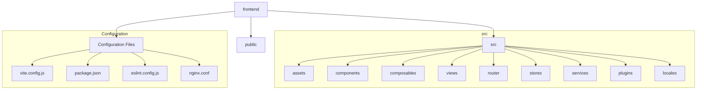

# Front-End Architecture Review

This document provides a comprehensive review of the front-end architecture of the project, based on an analysis of the `frontend/` directory.

## 1. Framework and Build Tools

- **Framework**: The project is built using **Vue.js 3**, leveraging its modern features, including the Composition API.
- **Build Tool**: **Vite** is used as the build tool, providing a fast development server and optimized production builds.

## 2. Project Structure

The project follows a standard and well-organized structure for a modern Vue application.

- **`src/`**: Contains the core application source code.
  - **`assets/`**: Static assets like CSS and images.
  - **`components/`**: Reusable Vue components.
  - **`composables/`**: Reusable Composition API functions.
  - **`views/`**: Page-level components tied to specific routes.
  - **`router/`**: Routing configuration.
  - **`stores/`**: State management (Pinia).
  - **`services/`**: API communication layer.
  - **`plugins/`**: Vue plugins, such as `i18n`.
  - **`locales/`**: Internationalization (i18n) language files.

## 3. Key Dependencies

The project leverages a modern and powerful set of libraries:

- **`vue-router`**: For client-side routing.
- **`pinia`**: For client-side state management.
- **`axios`**: For making HTTP requests to the back-end.
- **`@tanstack/vue-query`**: For managing server state, including caching, refetching, and synchronization.
- **`vue-i18n`**: For internationalization.

## 4. Configuration

### Build Configuration (`vite.config.js`)

The Vite configuration is well-optimized for both development and production:
- **Development**: Uses a proxy to forward `/api` requests to the back-end, avoiding CORS issues.
- **Production**:
  - Implements code splitting (`manualChunks`) to separate vendor code and large components into different chunks.
  - Uses `vite-plugin-compression` to Gzip assets.
  - Removes `console.log` and `debugger` statements from the production build.
- **Analysis**: Includes `rollup-plugin-visualizer` to analyze bundle size.

### Code Quality (`eslint.config.js` & `.prettierrc.json`)

- **Linting**: Uses ESLint with the latest "flat" configuration, extending recommended rules for JavaScript and Vue.
- **Formatting**: Uses Prettier to enforce a consistent code style (80-char line width, single quotes, trailing commas).
- **Integration**: `eslint-config-prettier` is used to prevent conflicts between ESLint and Prettier.

### Deployment (`nginx.conf`)

- A standard Nginx configuration is provided to serve the application as a Single Page Application (SPA), correctly handling client-side routing by redirecting all non-asset requests to `index.html`.

## 5. Routing Strategy

- **Mode**: Uses HTML5 History Mode (`createWebHistory`) for clean URLs.
- **Authentication**: A global navigation guard (`router.beforeEach`) is implemented to protect routes. Routes requiring authentication are marked with `meta: { requiresAuth: true }`. Unauthenticated users are redirected to the `/login` page.
- **Code Splitting**: Views are lazy-loaded using dynamic `import()` statements, which improves initial load performance.

## 6. State Management Pattern

The project employs a sophisticated state management strategy that separates concerns effectively:

- **Client State**: Managed by **Pinia**. This is used for global UI state that is not tied to the server, such as the current theme or language preference (`unionStore`). The `authStore` also falls into this category, managing the user's authentication token and profile.
- **Server State**: Managed by **`@tanstack/vue-query`**. All data fetching, caching, and synchronization with the back-end is delegated to this library. This is a modern best practice that simplifies data management and eliminates the need for complex state management logic for server data in Pinia.

This separation is a key strength of the architecture, making the state logic cleaner and more maintainable.

## 7. Internationalization (i18n)

- **Library**: Uses `vue-i18n` in Composition API mode (`legacy: false`).
- **Initialization**: The initial locale is determined in a robust way:
  1.  From the user's saved preference in Pinia (`localStorage`).
  2.  Falls back to the browser's default language (`navigator.language`).
  3.  Defaults to 'en'.
- **Integration**: The i18n plugin is cleverly integrated with Pinia to ensure the store is available before the initial locale is set.
- **Languages**: Supports English, Simplified Chinese, Traditional Chinese, Japanese, and Korean.

## Summary

The front-end architecture is modern, robust, and well-structured. It follows current best practices for Vue.js development, demonstrating a strong emphasis on:

- **Developer Experience**: Fast build tools, clear project structure, and integrated code quality tools.
- **Performance**: Code splitting, asset compression, and efficient data fetching strategies.
- **Maintainability**: Clear separation of concerns (e.g., client vs. server state), modular design, and consistent coding standards.

This architecture provides a solid foundation for building and scaling the application.