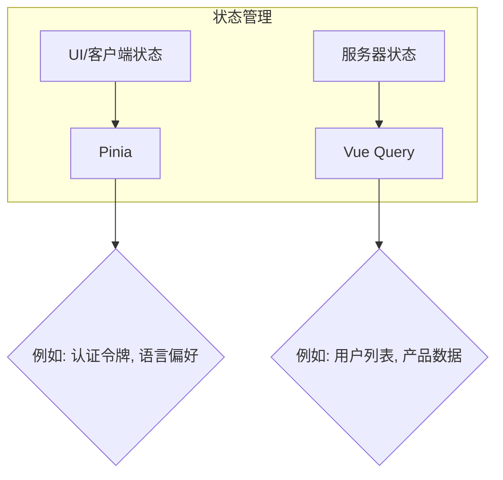

# 前端开发指南

本文档是项目前端开发的官方指南，旨在为所有开发人员（包括人类和 AI 助手）提供一套明确的规范和最佳实践。

## 1. 核心架构原则

### 1.1. 技术栈

项目采用现代化的 Vue.js 技术栈，旨在实现高效开发和卓越性能：

*   **框架**: Vue 3
*   **构建工具**: Vite
*   **客户端状态管理**: Pinia
*   **服务器状态管理**: @tanstack/vue-query (Vue Query)

### 1.2. 状态管理分离

为了保证代码的清晰和可维护性，我们严格区分两种类型的状态：

*   **UI/客户端状态**: 使用 **Pinia** 管理。这包括与 UI 相关的状态（如主题、语言设置）或不直接与服务器数据同步的客户端数据（如用户的认证令牌和基本资料）。
*   **服务器状态**: 使用 **Vue Query** 管理。所有与后端 API 的交互，包括数据获取、缓存、同步和变更，都必须通过 Vue Query 进行。这极大地简化了数据流，并提供了开箱即用的功能，如自动重试、缓存失效和后台更新。



## 2. 编码规范与最佳实践

### 2.1. 认证逻辑

所有新的认证相关逻辑（如注册、密码重置、个人资料更新等）**必须**添加到 [`frontend/src/stores/authStore.js`](frontend/src/stores/authStore.js:1) 中。这确保了所有认证流程的集中管理和一致性。

### 2.2. 组件开发

*   **可重用性**: 积极创建和使用可重用的基础组件。对于常见的 UI 元素，如输入框、按钮、模态框等，应优先创建 `BaseInput`、`BaseButton` 这样的基础组件。
*   **目的**: 确保 UI 的一致性，减少代码重复，并使未来的重构更加容易。

### 2.3. 命名约定

*   **Pinia Stores**: store 的命名必须保持一致性，以准确反映其功能。
    *   **文件名**: `userStore.js`
    *   **Store ID**: `'user'`
    *   **Hook**: `useUserStore`

### 2.4. API 交互

*   **服务层**: 所有 API 调用都应通过 `/services` 目录中的服务文件进行。不允许在组件或 store 中直接调用 `axios`。
*   **拦截器**: 利用现有的 `axios` 拦截器（位于 [`frontend/src/services/api.js`](frontend/src/services/api.js:1)）进行全局错误处理和认证令牌注入。

### 2.5. 用户体验 (UX)

*   **通知**: **严禁**使用原生的 `alert()` 和 `confirm()` 函数，因为它们会阻塞浏览器线程并提供不佳的用户体验。
*   **替代方案**: 使用统一的、非阻塞的 UI 组件（如 Toasts 或 Modals）来向用户显示通知、确认信息或错误。

## 3. 路由

### 3.1. 懒加载

所有新的视图路由**必须**使用懒加载（`() => import(...)`）来定义。这有助于减小初始包体积，优化应用的首次加载性能。

```javascript
// 正确示例
{
  path: '/profile',
  name: 'Profile',
  component: () => import('../views/ProfileView.vue'),
  meta: { requiresAuth: true }
}
```

### 3.2. 认证重定向

在需要认证的路由中，必须实现一个健壮的重定向逻辑。如果未认证的用户尝试访问受保护的页面，导航守卫应将他们重定向到登录页，并将他们最初意图访问的路径作为查询参数。

登录成功后，应用应自动将用户导航到他们最初想访问的页面。

## 4. 代码风格

项目使用 **Prettier** 和 **ESLint** 来强制执行统一的代码风格。所有代码提交都**必须**符合这些工具定义的规则。在提交代码之前，请确保运行 `npm run lint` 并修复所有错误。