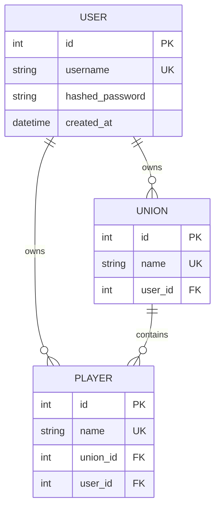
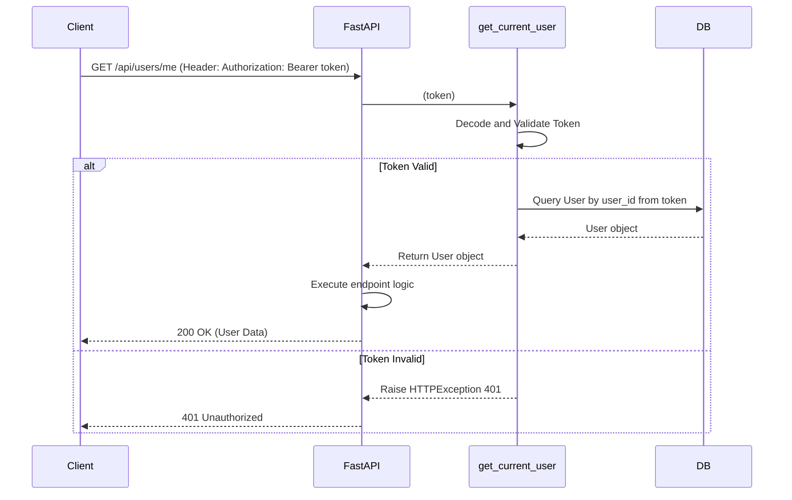
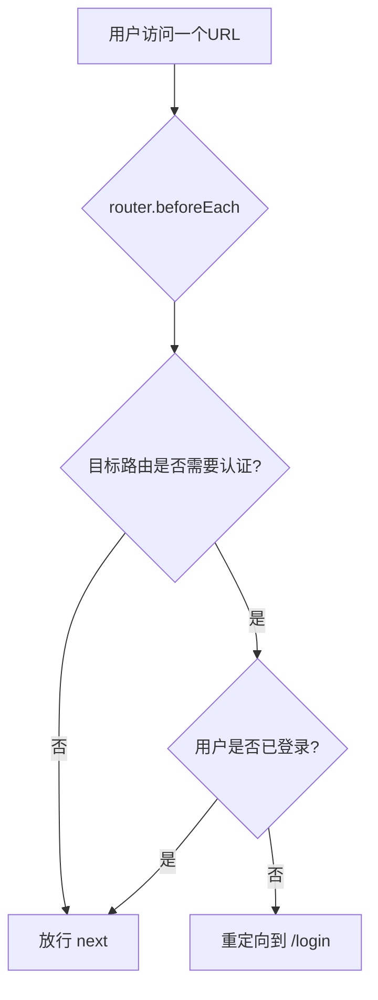

# 用户管理系统技术方案

**版本:** 1.0
**作者:** Kilo Code

## 1. 概述

本文档旨在为用户管理系统的开发提供详细的技术设计和实施指南。该系统将引入用户认证、授权和数据隔离机制，确保每个用户只能访问和管理自己的数据。

## 2. 后端设计

### 2.1. 数据库模型 (`models.py`)

#### 2.1.1. 新增 `User` 模型

```python
# backend/models.py
import datetime
from sqlalchemy import Column, Integer, String, DateTime, ForeignKey
from sqlalchemy.orm import relationship

class User(Base):
    __tablename__ = "users"
    id = Column(Integer, primary_key=True, index=True)
    username = Column(String, unique=True, index=True, nullable=False)
    hashed_password = Column(String, nullable=False)
    created_at = Column(DateTime, default=datetime.datetime.utcnow)

    unions = relationship("Union", back_populates="owner")
    players = relationship("Player", back_populates="owner")
```

#### 2.1.2. 改造 `Union` 和 `Player` 模型

- **`Union` 模型**:
  ```python
  # ...
  user_id = Column(Integer, ForeignKey("users.id"))
  owner = relationship("User", back_populates="unions")
  # ...
  ```
- **`Player` 模型**:
  ```python
  # ...
  user_id = Column(Integer, ForeignKey("users.id"))
  owner = relationship("User", back_populates="players")
  # ...
  ```

#### 2.1.3. 数据关系图



### 2.2. 认证与授权

#### 2.2.1. 认证方案

- **技术选型**: JWT (JSON Web Tokens)
- **依赖库**: `passlib[bcrypt]`, `python-jose[cryptography]`, `python-multipart`

#### 2.2.2. 密码与令牌处理 (`backend/security.py`)

- **密码哈希**: 使用 `passlib.context.CryptContext` 和 `bcrypt` 算法。
- **JWT 令牌**:
  - **配置**: 在 `.env` 中设置 `SECRET_KEY` 和 `ALGORITHM=HS256`。
  - **核心函数**: `create_access_token` 和 `decode_access_token`。

#### 2.2.3. FastAPI 依赖项 (`backend/dependencies.py`)

- 创建 `get_current_user` 依赖项，负责从 `Authorization` 头中解析 Bearer Token，验证并返回对应的 `User` 数据库对象。无效的 Token 将导致 `HTTP 401` 错误。

#### 2.2.4. 认证流程



### 2.3. API 接口 (`schemas.py` & `main.py`)

#### 2.3.1. Pydantic Schemas

- `UserBase`, `UserCreate`, `User`
- `Token`, `TokenData`

#### 2.3.2. API Endpoints

- `POST /api/users/`: 用户注册。
- `POST /api/auth/token`: 用户登录，返回 JWT。
- `GET /api/users/me`: 获取当前用户信息（需要认证）。

### 2.4. 数据隔离改造

- **服务层 (`services.py`)**: 所有涉及数据读写的函数（如 `get_characters_service`, `update_or_create_player`）必须增加 `user_id: int` 参数，并在数据库查询时加入 `WHERE user_id = :user_id` 条件。
- **路由层 (`main.py`)**: 在所有受保护的端点中注入 `get_current_user` 依赖，并将 `current_user.id` 传递给服务层。

## 3. 前端设计

### 3.1. 状态管理 (`stores/authStore.js`)

- **State**: `token` (从 `localStorage` 初始化), `user`。
- **Getters**: `isAuthenticated`。
- **Actions**: `login`, `logout`, `register`, `fetchUser`。
- **持久化**: Token 将存储在 `localStorage` 中以维持会话。

### 3.2. API 服务 (`services/api.js`)

- 实现一个 Axios **请求拦截器** (`request.use`)。
- 拦截器在每个请求发送前，从 `authStore` 读取 token，并将其添加到 `Authorization: Bearer <token>` 请求头中。

### 3.3. 路由 (`router/index.js`)

- **新路由**: `/login`, `/register`。
- **路由元信息**: 为需要认证的路由添加 `meta: { requiresAuth: true }`。
- **全局导航守卫 (`router.beforeEach`)**:
  - 如果路由需要认证且用户未登录，则重定向到 `/login`。
  - 其他情况则放行。

#### 3.3.1. 导航守卫流程



## 4. 实施计划

建议按照以下顺序进行开发：

1.  **后端**:
    1.  实现数据库模型和认证工具。
    2.  实现用户注册和登录 API。
    3.  对现有服务和 API 端点进行数据隔离改造。
2.  **前端**:
    1.  创建 `authStore`。
    2.  实现 API 请求拦截器。
    3.  创建登录/注册页面和路由。
    4.  实现导航守卫。

---
**文档结束**