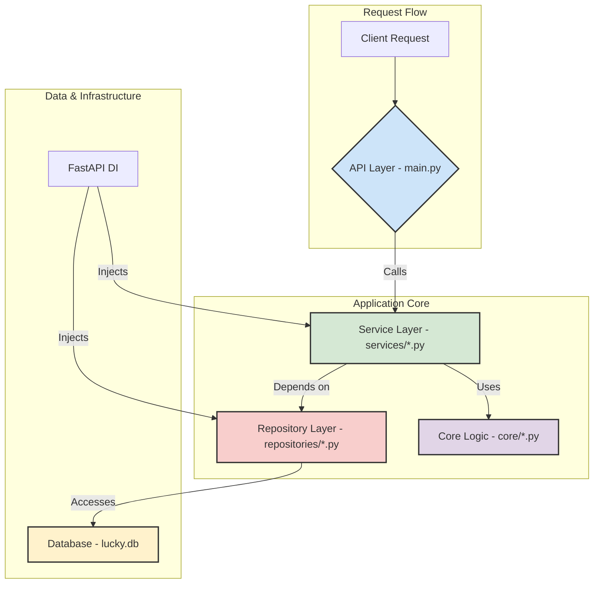

# 后端重构与修复详细计划

本文档基于 `docs/backend_review.md` 的深度审查结果，并遵循**“架构优先”**的核心战略，制定了一套全面、分阶段、且可操作的执行计划，旨在系统性地解决当前后端代码库中存在的关键问题。

## 第一部分：总体评估与战略概述

### 问题根源分析

对 `docs/backend_review.md` 的分析揭示了几个根本性问题：
1.  **架构边界模糊**: 业务逻辑在 API 层 (`main.py`) 和服务层 (`services.py`) 之间随意泄露，缺乏清晰的职责划分。
2.  **模块设计缺陷**: `services.py` 已演变为一个“上帝模块”，聚合了过多不相关的职责，导致高耦合和低内聚。
3.  **缺乏分层抽象**: 业务逻辑与数据访问逻辑（SQLAlchemy 调用）紧密耦合在服务层中，使得单元测试变得异常困难。
4.  **安全意识缺失**: 关键的写操作 API 缺少认证，且存在硬编码密钥等严重安全漏洞。
5.  **开发规范欠缺**: 代码中充斥着硬编码的“魔法值”，缺乏统一的常量管理、日志记录和错误处理规范。

### 重构核心目标

本次重构旨在达成以下核心目标：
*   **建立清晰的架构**: 塑造一个职责分明、易于理解和扩展的分层架构（API -> Service -> Repository）。
*   **提升代码质量与可维护性**: 消除“上帝模块”，降低圈复杂度，实现高内聚、低耦合。
*   **增强系统可测试性**: 通过依赖注入和分层抽象，使核心业务逻辑能够被独立、高效地进行单元测试。
*   **根除关键安全隐患**: 在稳固的架构之上，系统性地修复所有已知的安全漏洞。
*   **提升性能与可观测性**: 解决性能瓶颈（如 N+1 问题），并为系统未来的监控和运维打下基础。

### 总体执行策略

我们将严格遵循**“架构优先，修复其次”**的核心原则。鉴于项目处于开发阶段，我们优先投入资源进行结构性重构。此举旨在避免在即将被废弃的旧架构上进行零散的、治标不治本的修复。

执行路径如下：
1.  **先立骨架**: 首先进行核心架构重构，搭建起稳固的、可测试的、分层清晰的代码结构。
2.  **再填血肉**: 在新架构的基础上，进行关键的安全修复和性能优化。
3.  **后修枝叶**: 最后处理剩余的非关键性问题，并完善可观测性等高级特性。

这种策略将确保每一项修复和改进都建立在坚实的基础之上，最大化每次投入的长期价值。

## 第二部分：分阶段执行计划

根据“架构优先”的策略，我们将重构过程划分为以下四个逻辑递进的阶段：

### **第一阶段：核心架构与基础重构 (Core Architecture & Foundational Refactoring)**
*   **目标**: 搭建清晰的 Service-Repository 分层架构，实现业务逻辑与数据访问的完全解耦，并拆分“上帝模块”。这是整个重构工作的基石。

### **第二阶段：关键安全与性能修复 (Critical Security & Performance Fixes)**
*   **目标**: 在新架构之上，根除所有“关键”和“高”风险等级的安全漏洞，并解决最紧迫的性能瓶颈（N+1查询）。

### **第三部分：提升可测试性与异步能力 (Enhancing Testability & Asynchronous Capabilities)**
*   **目标**: 进一步提升代码质量，将复杂逻辑提炼为纯函数，并引入异步数据库操作以提升系统并发处理能力。

### **第四阶段：完善可观测性与长期优化 (Completing Observability & Long-term Optimizations)**
*   **目标**: 引入结构化日志、监控和链路追踪，建立统一的错误处理机制，为项目的长期运维和稳定性提供保障。

---

## 第三部分：各阶段详细任务清单

### **第一阶段：核心架构与基础重构**

---

**任务ID**: `R-01`
**任务标题**: 引入仓库模式 (Repository Pattern) 并创建 Repository 层
**问题描述与来源**: 核心业务逻辑与数据库实现（SQLAlchemy）在 `services.py` 中紧密耦合，导致单元测试极难编写。(来源: `docs/backend_review.md` - 维度五：可测试性)
**目标与理由 (Why)**: 这是实现“架构优先”的第一步。通过创建一个专门的数据访问层（Repository），可以将业务逻辑（Service）与数据持久化逻辑彻底分离。这使得 Service 层可以依赖于抽象的 Repository 接口，而不是具体的数据库实现，从而让 Service 层的单元测试变得简单（可以使用 Mock Repository）。
**实施建议 (How)**:
1.  在 `backend/` 下创建 `repositories/` 目录。
2.  创建 `repositories/base.py` 定义一个通用的 `Repository` 基类。
3.  为每个模型（如 `User`, `Character`）创建对应的仓库文件，例如 `repositories/user_repository.py`。
4.  将 `services.py` 中所有直接的 `db.query(...)`、`db.add(...)` 等数据库操作，迁移到相应的 Repository 方法中（如 `get_user_by_id`, `create_user`）。
5.  使用 FastAPI 的依赖注入系统，在 Service 层中注入 Repository 的实例。

### 目标架构可视化

为了更直观地展示重构后的代码结构，以下是目标架构的 Mermaid 流程图：

**影响范围**: `backend/services.py`, `backend/main.py` (需要更新依赖注入)。需要新建 `backend/repositories/` 目录及相关文件。
**预估复杂度**: L
**前置依赖**: 无
**风险与规避措施**:
*   风险：大规模代码移动可能引入逻辑错误。
*   规避措施：在迁移过程中，为每个被移动的查询逻辑编写集成测试，确保其行为与迁移前保持一致。
**验证标准 (Done Criteria)**:
*   `backend/services/` 目录下的所有文件中不再包含任何 `sqlalchemy` 的直接调用。
*   所有数据访问都通过注入的 Repository 实例进行。
*   现有的 API 功能保持不变（通过手动测试或现有测试验证）。

---

**任务ID**: `R-02`
**任务标题**: 拆分“上帝模块” `services.py`
**问题描述与来源**: `services.py` 职责混杂，包含了用户、角色、模拟等多个不同领域的业务逻辑，难以维护和理解。(来源: `docs/backend_review.md` - 维度一：架构设计与代码结构)
**目标与理由 (Why)**: 遵循单一职责原则，将 `services.py` 拆分为多个独立的、按领域划分的 Service 模块。这可以极大地提高代码的内聚性、可读性和可维护性，并为后续并行开发不同功能模块奠定基础。
**实施建议 (How)**:
1.  在 `backend/` 下创建 `services/` 目录。
2.  根据业务领域，将 `services.py` 的内容拆分到 `services/user_service.py`, `services/character_service.py`, `services/simulation_service.py` 等新文件中。
3.  每个新的 Service 文件应依赖于 `R-01` 中创建的 Repository 层来获取数据。
4.  更新 API 层 (`main.py`)，使其从新的 Service 模块中导入并注入相应的 Service 实例。
**影响范围**: `backend/services.py` (将被删除), `backend/main.py`。需要新建 `backend/services/` 目录及相关文件。
**预估复杂度**: M
**前置依赖**: `R-01`
**风险与规避措施**:
*   风险：函数/方法在文件间移动可能导致循环依赖。
*   规避措施：在拆分前先绘制模块依赖图，确保拆分方案合理。拆分后，利用静态分析工具检查循环依赖问题。
**验证标准 (Done Criteria)**:
*   `backend/services.py` 文件被完全删除。
*   新的 `backend/services/` 目录结构清晰，每个 Service 文件职责单一。
*   所有 API 端点都能正确调用到新的 Service。

---

**任务ID**: `R-03`
**任务标题**: 清理 API 层，将业务逻辑移至 Service 层
**问题描述与来源**: 大量业务逻辑（如数据计算、状态转换）直接写在了 `main.py` 的 API 端点处理函数中，违反了分层架构原则。(来源: `docs/backend_review.md` - 维度一：架构设计与代码结构)
**目标与理由 (Why)**: 保持 API 层的纯粹性，使其只负责请求的接收、参数的校验和响应的格式化。所有业务逻辑都应封装在 Service 层中。这使得业务逻辑可以被复用，并且独立于 Web 框架。
**实施建议 (How)**:
1.  逐一审查 `main.py` 中的每个 API 端点。
2.  识别出所有不属于请求/响应处理的业务逻辑代码。
3.  将这些逻辑迁移到 `R-02` 中创建的相应 Service 模块的方法中。
4.  API 端点中只保留对 Service 方法的调用。
**影响范围**: `backend/main.py`, `backend/services/*`
**预估复杂度**: M
**前置依赖**: `R-02`
**风险与规避措施**:
*   风险：逻辑迁移不完整，导致部分业务规则丢失。
*   规避措施：对每个重构的端点进行端到端测试，确保其业务功能与重构前完全一致。
**验证标准 (Done Criteria)**:
*   `main.py` 中的 API 端点函数变得非常“薄”，主要由参数校验和对 Service 的调用组成。
*   所有业务逻辑都存在于 `services/` 目录下的文件中。

---

**任务ID**: `R-04`
**任务标题**: 建立统一的常量管理
**问题描述与来源**: 代码中散布着大量硬编码的“魔法数字/字符串”，例如用于计算的系数、状态标识等。(来源: `docs/backend_review.md` - 维度二：代码质量与可维护性)
**目标与理由 (Why)**: 将所有硬编码值集中管理，可以提高代码的可读性、可维护性，并避免因修改遗漏而导致的 bug。
**实施建议 (How)**:
1.  在 `backend/` 下创建 `constants.py` 文件。
2.  将项目中所有硬编码的字符串、数字等值，以大写变量名的形式定义在 `constants.py` 中。
3.  在业务代码中，导入并使用这些常量，替换掉原来的硬编码值。
**影响范围**: `backend/services/*`, `backend/main.py` 等所有使用了硬编码值的文件。
**预估复杂度**: S
**前置依赖**: `R-03`
**风险与规避措施**:
*   风险：替换时可能遗漏或替换错误。
*   规避措施：使用全局搜索功能查找所有潜在的魔法值。替换后进行代码审查。
**验证标准 (Done Criteria)**:
*   项目中不再存在业务逻辑相关的硬编码值。
*   所有此类值都从 `constants.py` 中导入。

### **第二阶段：关键安全与性能修复**

---

**任务ID**: `S-01`
**任务标题**: **[关键]** 修复所有写操作 API 的访问控制漏洞
**问题描述与来源**: 多个高权限写操作 API（如删除、清空数据）完全没有身份验证，任何人都可以调用。(来源: `docs/backend_review.md` - 维度四：安全性)
**目标与理由 (Why)**: 这是最严重的安全漏洞，必须在新架构稳定后立即修复，以防止任何未经授权的数据修改或破坏。
**实施建议 (How)**:
1.  全面审查 `main.py` 中所有的 `POST`, `PUT`, `DELETE` 端点。
2.  为所有缺失认证的端点添加 `Depends(auth.get_current_user)` 依赖。
3.  可以考虑创建一个 `AdminRequired` 依赖，用于保护只有管理员才能访问的超高权限 API。
**影响范围**: `backend/main.py`, `backend/auth.py`
**预估复杂度**: M
**前置依赖**: `R-03`
**风险与规避措施**:
*   风险：可能会错误地保护了公共 API，或遗漏了需要保护的 API。
*   规避措施：制定一份详细的 API 权限清单，并根据清单进行逐一核对和修复。修复后需要进行全面的权限测试。
**验证标准 (Done Criteria)**:
*   所有非公共的写操作 API 在未提供有效 token 的情况下访问，均返回 401 Unauthorized 错误。
*   所有需要特定角色的 API 在使用权限不足的 token 访问时，均返回 403 Forbidden 错误。

---

**任务ID**: `S-02`
**任务标题**: **[关键]** 移除硬编码的后备 `SECRET_KEY`
**问题描述与来源**: `auth.py` 中存在一个硬编码的后备 `SECRET_KEY`，如果环境变量未设置，就会使用这个固定的密钥，导致身份验证机制可被轻易破解。(来源: `docs/backend_review.md` - 维度四：安全性)
**目标与理由 (Why)**: 消除因固定密钥导致的安全风险。强制要求在生产环境中必须通过环境变量配置 `SECRET_KEY`。
**实施建议 (How)**:
1.  删除 `auth.py` 中的后备 `SECRET_KEY`。
2.  修改代码，在应用启动时检查 `SECRET_KEY` 环境变量是否已设置。如果未设置，应直接抛出异常并终止应用启动。
3.  更新 `.env.example` 和部署文档，强调 `SECRET_KEY` 的重要性。
**影响范围**: `backend/auth.py`
**预估复杂度**: S
**前置依赖**: 无
**风险与规避措施**:
*   风险：可能导致本地开发环境启动失败。
*   规避措施：在 `README.md` 或开发文档中明确指出本地开发需要创建 `.env` 文件并设置 `SECRET_KEY`。
**验证标准 (Done Criteria)**:
*   代码中不再存在任何硬编码的 `SECRET_KEY`。
*   在未设置 `SECRET_KEY` 环境变量的情况下启动应用，应用会失败并报错。

---

**任务ID**: `P-01`
**任务标题**: 解决 `run_damage_simulation` 中的 N+1 查询问题
**问题描述与来源**: 在 `run_damage_simulation` 函数的循环中，每次迭代都会触发一次数据库查询，导致性能随用户数增长而急剧下降。(来源: `docs/backend_review.md` - 维度三：性能与可伸缩性)
**目标与理由 (Why)**: 这是当前最主要的性能瓶颈。通过一次性批量加载所有需要的数据，可以将原本的 N+1 次查询减少为少数几次查询，极大地提升 API 性能和数据库效率。
**实施建议 (How)**:
1.  在 `simulation_service.py` 中找到 `run_damage_simulation` 方法。
2.  在进入主循环之前，收集所有需要查询的角色/装备 ID。
3.  使用 `SQLAlchemy` 的 `selectinload` 或 `joinedload` 策略，或者直接使用 `WHERE id IN (...)` 的方式，在循环外一次性查询出所有相关的数据对象。
4.  在循环中，从预加载的数据中获取对象，而不是再次查询数据库。
**影响范围**: `backend/services/simulation_service.py`, `backend/repositories/character_repository.py`
**预估复杂度**: M
**前置依赖**: `R-02`
**风险与规避措施**:
*   风险：预加载逻辑可能编写错误，导致加载了过多或过少的数据。
*   规避措施：编写针对性的集成测试，模拟不同数量级的输入，并断言数据库查询的总次数是否符合预期（例如，始终为常数次）。
**验证标准 (Done Criteria)**:
*   通过日志或性能分析工具确认，调用 `run_damage_simulation` 时，数据库查询次数不再随输入规模线性增长。
*   API 响应时间得到显著改善。

### **第三阶段：提升可测试性与异步能力**

---

**任务ID**: `T-01`
**任务标题**: 将复杂计算重构为可独立测试的纯函数
**问题描述与来源**: 类似 `run_damage_simulation` 的函数中混合了数据获取、复杂计算和数据持久化等多个职责，难以测试。(来源: `docs/backend_review.md` - 维度五：可测试性)
**目标与理由 (Why)**: 将核心的、复杂的计算逻辑抽离成纯函数（输入相同，输出永远相同，无副作用）。这使得我们可以脱离数据库和外部依赖，为这些核心算法编写快速、可靠的单元测试。
**实施建议 (How)**:
1.  在 `backend/` 下创建 `core/` 或 `logic/` 目录，用于存放纯业务逻辑。
2.  例如，创建一个 `core/simulation_logic.py` 文件。
3.  将 `simulation_service.py` 中关于伤害计算的核心算法，提取到一个新的函数 `calculate_damage(character_stats, equipment_stats)` 中。这个函数只接受数据作为输入，并返回计算结果。
4.  在 Service 层中，先通过 Repository 获取数据，然后调用这个纯函数进行计算，最后再通过 Repository 持久化结果。
**影响范围**: `backend/services/simulation_service.py`。需要新建 `backend/core/` 目录及相关文件。
**预估复杂度**: M
**前置依赖**: `R-02`
**风险与规避措施**:
*   风险：函数签名设计不合理，导致需要频繁修改。
*   规避措施：在重构前仔细设计纯函数需要的数据结构（DTOs），确保其稳定性和通用性。
**验证标准 (Done Criteria)**:
*   核心计算逻辑被封装在纯函数中。
*   能够为这些纯函数编写并运行单元测试，且无需任何数据库连接。
*   Service 层的对应方法变得更简洁，主要负责编排数据流。

---

**任务ID**: `P-02`
**任务标题**: 实现数据库操作异步化
**问题描述与来源**: 项目目前使用同步的数据库驱动和会话，这会阻塞 FastAPI 的事件循环，限制高并发处理能力。(来源: `docs/backend_review.md` - 维度三：性能与可伸缩性)
**目标与理由 (Why)**: 将所有数据库 I/O 操作从同步改为异步，可以充分利用 FastAPI 的异步特性，显著提高应用在 I/O 密集型场景下的并发性能和吞吐量。
**实施建议 (How)**:
1.  在 `requirements.txt` 中，将 `psycopg2-binary` 替换为异步驱动，如 `asyncpg`。
2.  修改 `database.py`，使用 `create_async_engine` 和 `AsyncSession` 替换同步的 `create_engine` 和 `Session`。
3.  将所有 Repository 层的方法从 `def` 改为 `async def`。
4.  在方法内部，使用 `await db.execute(...)` 等异步方式执行查询。
5.  连锁修改所有调用链，将 Service 层和 API 层对应的方法也改为 `async def`。
**影响范围**: 整个后端项目的所有数据访问相关代码，包括 `database.py`, `repositories/*`, `services/*`, `main.py`。
**预估复杂度**: L
**前置依赖**: `R-01`
**风险与规避措施**:
*   风险：`async/await` 语法改造可能遗漏，导致运行时出现 `Coroutine was never awaited` 等错误。
*   规避措施：使用静态分析工具（如 `flake8-async`）检查异步代码的正确性。进行全面的端到端回归测试。
**验证标准 (Done Criteria)**:
*   项目中不再有同步的数据库调用。
*   所有与数据库交互的 API 路径都以 `async def` 定义。
*   在压力测试下，应用的并发处理能力有明显提升。

### **第四阶段：完善可观测性与长期优化**

---

**任务ID**: `O-01`
**任务标题**: 规范日志记录，引入结构化日志
**问题描述与来源**: 项目中使用 `print()` 进行日志记录，缺乏日志级别、上下文等关键信息，难以在生产环境中进行问题排查。(来源: `docs/backend_review.md` - 维度六：可观测性与运维)
**目标与理由 (Why)**: 建立一套统一、规范、结构化的日志系统，是保障生产环境稳定性和快速排障能力的基础。
**实施建议 (How)**:
1.  在项目中全面用 Python 标准的 `logging` 模块替换 `print()`。
2.  配置日志格式化程序（Formatter），输出 JSON 格式的结构化日志。
3.  在日志中包含时间戳、日志级别、模块名、函数名、行号等信息。
4.  创建一个 FastAPI 中间件，为每个请求生成一个唯一的 `request_id`，并将其注入到日志上下文中，以便追踪整个请求链路的日志。
**影响范围**: 整个项目。
**预估复杂度**: M
**前置依赖**: 无
**风险与规避措施**:
*   风险：日志配置过于复杂或不当，可能影响性能。
*   规避措施：在开发环境进行充分测试，确保日志输出符合预期且性能开销在可接受范围内。
**验证标准 (Done Criteria)**:
*   项目中所有的 `print()` 调用都被替换为 `logging` 调用。
*   应用输出的日志为结构化的 JSON 格式。
*   每个请求的所有相关日志都包含相同的 `request_id`。

---

**任务ID**: `O-02`
**任务标题**: 建立统一的全局异常处理器
**问题描述与来源**: 错误处理不统一，部分异常直接暴露了堆栈信息等敏感内容给客户端。(来源: `docs/backend_review.md` - 维度六：可观测性与运维)
**目标与理由 (Why)**: 统一处理所有未被捕获的异常，避免向客户端泄露敏感信息，并提供统一、友好的错误响应格式。
**实施建议 (How)**:
1.  使用 FastAPI 的 `@app.exception_handler(Exception)` 装饰器创建一个全局异常处理器。
2.  在该处理器中，记录完整的异常信息（包括堆栈）到日志系统。
3.  向客户端返回一个通用的、不包含敏感信息的 500 Internal Server Error 响应。
4.  可以根据需要，为特定的自定义异常（如 `ValidationError`）创建更具体的异常处理器。
**影响范围**: `backend/main.py`
**预估复杂度**: S
**前置依赖**: `O-01`
**风险与规避措施**:
*   风险：全局处理器可能捕获了不应被捕获的异常（如 FastAPI 自身的 `HTTPException`）。
*   规避措施：在处理器中添加逻辑，对特定类型的异常进行判断和区分处理。
**验证标准 (Done Criteria)**:
*   应用在遇到任何未处理的异常时，客户端收到的都是统一格式的 500 错误响应，不再暴露堆栈信息。
*   完整的错误信息被记录在日志中。