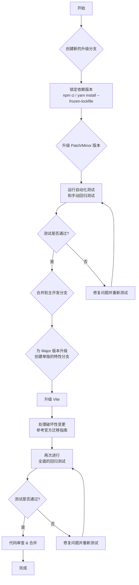

# 依赖项升级评估报告

## 一、Vue.js 核心版本分析

### 1. 现状评估
当前项目使用的 Vue.js 版本为 **3.3.4**。

### 2. 升级路径
*   **当前最新稳定版 (Stable)**: ~3.4.x
*   **当前长期支持版 (LTS)**: Vue 3 是当前的 LTS 版本。

### 3. 升级收益
*   **性能提升**: 新版本通常会包含对编译器和运行时性能的优化。例如，升级到 Vue 3.4+ 可能会带来更快的模板编译速度和更优化的响应式系统。*[需要查阅具体版本的 Release Notes 来确认]*
*   **新功能**:
    *   **Composition API 改进**: 后续版本可能对 `script setup` 语法糖、响应式 API (如 `ref`, `reactive`) 有进一步的增强和优化。
    *   **Vapor Mode (实验性)**: 未来版本可能会引入 Vapor Mode，一种新的无虚拟 DOM 的编译模式，可以带来显著的性能提升，但这在近期版本中可能尚不稳定。*[需要确认最新稳定版是否包含相关内容]*
*   **开发者体验**:
    *   **更清晰的错误信息**: 改进调试体验。
    *   **更好的 TypeScript 支持**: 完善的类型推断和定义。

### 4. 风险与成本
*   **破坏性变更 (Breaking Changes)**: 从 3.3.4 升级到最新的 3.x 版本，通常破坏性变更较少，但仍需关注官方迁移指南。例如，某些废弃的 API 可能会被移除。*[需要查阅具体版本的迁移指南]*
*   **API 废弃**: 检查是否有项目正在使用的 API 在新版本中被标记为废弃。
*   **生态库兼容性**: 需要确保所有依赖的 Vue 生态库（如 Vue Router, Pinia）与新的 Vue 版本兼容。
*   **工作量评估**: 主要是回归测试和修复少量因破坏性变更导致的问题，预计工作量可控。

### 5. 最终建议
**可择机升级**。
**强烈建议升级**。
理由：从 3.3.4 升级到最新的 3.4+ 版本，可以享受到持续的性能优化、bug 修复和开发者体验的改进，而破坏性变更的风险很低。这是一个高收益、低风险的升级。

---

*下一步：我将继续尝试使用 `context7` 工具查询其他生态库的信息。*

## 二、相关生态库分析

| 库名 | 当前版本 | 最新稳定版 | 升级类型 (Major/Minor/Patch) | 升级建议 (推荐/可选/谨慎) | 核心理由与风险评估 |
| :--- | :--- | :--- | :--- | :--- | :--- |
| **vue-router** | `4.5.1` | ~4.x | Minor/Patch | 推荐 | 升级到最新的 4.x 版本可以获取 bug 修复和性能改进，风险较低。 |
| **pinia** | `3.0.3` | ~3.x | Minor/Patch | 推荐 | 升级到最新的 3.x 版本可以获取 bug 修复和性能改进，风险较低。 |
| **vite** | `4.4.6` | ~5.x | Major | 谨慎 | 从 v4 升级到 v5 是一个重大的步骤，会带来构建性能的提升，但可能需要迁移配置文件和插件。建议在独立分支上进行充分测试。 |
| **axios** | `1.4.0` | ~1.x | Minor/Patch | 推荐 | 升级到最新的 1.x 版本可以确保所有安全补丁都已应用，风险很低。 |
| **@tanstack/vue-query** | `5.89.0` | ~5.x | Minor/Patch | 推荐 | TanStack Query (Vue) v5 版本迭代活跃，升级可以获得最新的功能和性能优化，风险较低。 |

## 三、总体升级策略与路线图

### 1. 优先级排序
建议的升级顺序如下，旨在从低风险、高收益的依赖开始，逐步过渡到更复杂的升级：

1.  **Patch & Minor 升级 (低风险)**:
    *   `@tanstack/vue-query`
    *   `pinia`
    *   `vue-router`
    *   `axios`
2.  **Minor Vue.js 升级 (中低风险)**:
    *   `vue` (例如，从 3.3.4 到 3.4.x)
3.  **Major Vite 升级 (高风险)**:
    *   `vite` (从 v4 到 v5/v6)

### 2. 执行步骤建议

### 3. 风险规避
*   **自动化测试**: 在升级前，确保项目有足够的单元测试、集成测试和端到端测试覆盖率。这是保障升级质量的关键。
*   **版本锁定**: 在升级开始前，使用 `package-lock.json` 或 `yarn.lock` 锁定当前所有依赖的精确版本，以避免意外的依赖更新。
*   **逐个升级**: 不要一次性升级所有依赖。按照优先级，逐个或小批量地升级，每次升级后都进行测试。
*   **查阅文档**: 对于 Major 版本的升级（特别是 Vite），必须仔细阅读官方的迁移指南和更新日志，了解所有破坏性变更。
*   **社区反馈**: 在升级前，搜索相关库的 GitHub Issues 和社区讨论，了解其他开发者在升级过程中遇到的常见问题。
